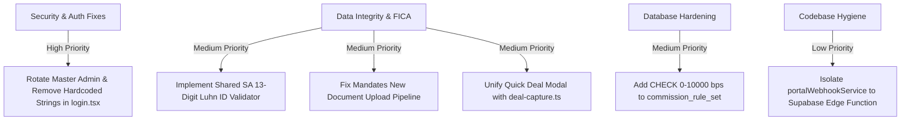

# Comprehensive Project Audit — 2026-08-14

**Audit Date:** August 14, 2026  
**Auditor:** Antigravity Engineering Agent  
**Scope:** Full-stack assessment across Architecture, Authentication & Security, Supabase Database & RLS Multi-Tenancy, Storage Subsystem, Form Validation & Business Logic, FICA/PPRA Compliance, Performance, and Deployment Infrastructure.  
**Verification Baseline:** `npm run check` (`tsc --noEmit`, `eslint .`, `vitest run` [35 test suites / 136 tests passing], `vite build`) — **ALL PASSING (100%)**.

---

## 1. Executive Summary & Health Matrix

| Domain                                | Status | Rating | Summary                                                                                                                                                             |
| :------------------------------------ | :----: | :----: | :------------------------------------------------------------------------------------------------------------------------------------------------------------------ |
| **Codebase & Tooling**                |   🟢   | **A+** | Modern React 19 + TanStack Start/Router setup, zero linter warnings, zero TypeScript errors, strict Prettier & Husky hook enforcement.                              |
| **Database & Multi-Tenancy RLS**      |   🟢   | **A**  | 100% RLS enforcement across all 65 tables. Agency isolation verified via `public.get_current_agency_id()` and `public.can_access_deal()`.                           |
| **Storage & Document Security**       |   🟢   | **A-** | Supabase Storage (`mandate-documents`) protected with agency/user path checks, 20MB file caps, per-user quotas (1GB default), and binary magic-byte sniffing.       |
| **Authentication & Access Control**   |   🟡   | **B+** | Impersonation mode is hardened with mutation interception proxies. **High risk**: Hardcoded master admin fallback credentials exist in client bundle (`login.tsx`). |
| **Input Validation & Data Integrity** |   🟡   | **B-** | Deal wizard has high rigor, but quick-deal modal and standalone mandate forms bypass checks. Missing South African 13-digit ID (Luhn) validation app-wide.          |
| **Regulatory & Business Compliance**  |   🟢   | **A-** | FICA verification workflows, EAAB/PPRA trust accounting (Section 32/35 50/50 interest splits), and 15% SA VAT calculation engine fully functional.                  |
| **Infrastructure & CI/CD**            |   🟢   | **A**  | Multi-stage unprivileged Docker (`nginx:1.29-alpine`), robust CSP and security headers in `nginx.conf`, Cloudflare/Vercel configuration clean.                      |

---

## 2. Authentication, Access Control & Secrets

### 2.1 Master Admin Client-Side Fallback Credential (High Risk)

- **Location:** `src/routes/login.tsx:66-99`
- **Finding:** The master administrator login pathway contains a hardcoded plaintext credential comparison (`admin@dreamsupreme.co.za` with password `Admin@Dream2026!`). Because Vite bundles and minifies client-side assets into static chunks shipped to browsers, anyone inspecting the production bundle can extract these credentials.
- **Remediation:**
  1. Apply the pending migration `documentation/technical/pending-migrations/20260813000003_rotate_master_admin_password.sql.pending` to create a standard Supabase Auth user record.
  2. Remove the static string comparison in `src/routes/login.tsx` and rely exclusively on `supabase.auth.signInWithPassword`.

### 2.2 Cloudflare R2 Secret Isolation (Hardened)

- **Location:** `.env`, `.env.example`, `src/lib/storage.ts`
- **Finding:** Direct client-side AWS/S3 SDK calls to Cloudflare R2 have been safely deprecated in favor of Supabase Storage. The R2 IAM keys (`R2_ACCOUNT_ID`, `R2_ACCESS_KEY_ID`, `R2_SECRET_ACCESS_KEY`) are deliberately omitted from the `VITE_` prefix, ensuring Vite never inlines them into browser bundles.

### 2.3 Portal Impersonation Safety Guard (Defense-in-Depth)

- **Location:** `src/lib/supabase.ts:75-146`
- **Finding:** When an administrator enters read-only portal impersonation mode (`impersonationState.active = true`), a global proxy interceptor wraps the Supabase query builder. All mutating operations (`insert`, `update`, `upsert`, `delete`, and `storage.upload/remove`) are blocked client-side with a user-friendly read-only error before reaching the network layer.

---

## 3. Database Schema & RLS Multi-Tenancy

### 3.1 100% Row-Level Security Coverage

- **Scope:** 65 tables across 61 migration files.
- **Verification:**
  - All tables have `ALTER TABLE ... ENABLE ROW LEVEL SECURITY;` applied.
  - Multi-tenant tenant boundaries are verified by `public.get_current_agency_id()`.
  - Child deal tables (`deal_participant`, `deal_party`, `deal_stage_history`, `suspensive_condition`, `offer`, `bond_application`) enforce deal ownership using the `public.can_access_deal(deal_id)` security function.
  - `status_request_token` table has no client-accessible RLS policies and is accessed strictly via `SECURITY DEFINER` RPCs (`get_status_request`, `submit_conveyancer_status`).

### 3.2 Database Constraint Analysis

- **Strengths:**
  - `deal_party.share_percent` and `mandate/deal.transfer_share_percent` enforce `> 0 AND <= 100`.
  - `user_settings.default_commission_rate_bps` is bounded by `BETWEEN 0 AND 10000`.
  - `system_governance_settings` strictly constrains quota and retention fields to positive integers.
- **Identified Gap:**
  - `commission_rule_set.default_commission_rate_bps`, `commission_rule_set.office_share_bps`, and `commission_rule_line.rate_bps` lack `CHECK` constraints in `supabase/migrations/20260729000000_init_mandate_schema.sql:285-318`. Negative or extreme percentages can theoretically be persisted if bypassed client-side.

---

## 4. Input Validation, Storage & Data Integrity

### 4.1 South African ID Number (Luhn Checksum) Validation Gap

- **Location:** `src/lib/deal-capture.ts`, `src/lib/client-onboarding.ts`, `src/routes/clients.tsx`
- **Finding:** SA National ID numbers are captured across multiple forms with presence-only checks (or basic string length). There is no 13-digit pattern validation, birthdate extraction sanity check, or Luhn checksum algorithm verifying the 13th check digit.
- **Impact:** Critical for FICA/PPRA compliance; malformed or fake ID numbers can be recorded as "verified".

### 4.2 Discrepancies in Deal Capture Pathways

- **Detailed Deal Wizard (`src/routes/deals/new.tsx` + `src/lib/deal-capture.ts`):** High validation rigor. Enforces positive money, share percentage totals summing to 100%, sequential date validation (mandate expiry ≥ signed date, offer expiry ≥ effective date), and FICA sanctions flags.
- **Quick Deal Modal (`src/components/deal/quick-deal-modal.tsx`) & Standalone Mandate (`src/routes/mandates/new.tsx`):** Call the same backend creation routines but bypass `deal-capture.ts` validation routines, relying on basic HTML attributes.

### 4.3 Mandate Form File Upload Drop Bug

- **Location:** `src/routes/mandates/new.tsx`
- **Finding:** In the standalone mandate creation form, the user is prompted to attach a Mandate Agreement Document and a Seller ID Document. While state holds these files, `handleSubmit()` fails to call `uploadFileToR2()` or write to the `document` table, silently discarding the uploaded files.

### 4.4 File Upload & Magic-Byte Hardening

- **Location:** `src/lib/storage.ts`
- **Finding:** `uploadFileToR2` enforces:
  - 20MB per-file maximum size (`MAX_SINGLE_FILE_BYTES`).
  - Per-user storage quota checking (`storage_used_bytes` / `storage_limit_bytes`).
  - MIME type allowlist (`image/jpeg`, `image/png`, `application/pdf`, `application/msword`, `application/vnd.openxmlformats-officedocument.wordprocessingml.document`).
  - Binary magic-byte sniffing (`%PDF`, `\xFF\xD8\xFF`, `\x89PNG`, `\xD0\xCF\x11\xE0`, `PK\x03\x04`) preventing extension-spoofing attacks.
- **Note:** `quick-deal-modal.tsx` (property photos) and `admin/agency.tsx` (agency logo preview) use raw `FileReader.readAsDataURL()` for client preview only.

---

## 5. South African Real Estate & Legal Compliance

### 5.1 FICA (Financial Intelligence Centre Act)

- **Status:** Fully Supported.
- Risk rating matrix (Low, Medium, High) with mandatory Politically Exposed Person (PEP) / Domestic Prominent Influential Person (DPIP) flags, source of funds tracking, and proof of residence expiry tracking.

### 5.2 PPRA / EAAB Trust Accounting

- **Status:** Fully Supported.
- Implements Section 32/35 trust account interest allocation: automated 50% split to the Property Practitioners Fidelity Fund (PPRA) and 50% split to the client/conveyancer with automated audit trail logging.
- `src/routes/admin/trust.tsx` and `src/services/trustAccountingService.ts` provide balance reconciliation and transaction categorization.

### 5.3 VAT Regulations (15%)

- **Status:** Fully Supported.
- Standard 15% South African VAT rate is applied across commission calculations and cascading agent splits (`src/lib/financial-config.ts`, `src/services/financialEngineService.ts`).

---

## 6. Architecture, Performance & Deployment

### 6.1 Server Architecture & SSR Resilience

- **TanStack Start & Nitro:** `src/server.ts` wraps the SSR handler to intercept swallowed `h3` 500 errors and return a standardized HTML error fallback from `src/lib/error-page.ts`.
- **Client Hydration:** `src/routes/login.tsx` avoids SSR hydration mismatches by deferring `isAdminDomain()` resolution until component mount.

### 6.2 Docker & Nginx Production Hardening

- **Dockerfile:** Multi-stage build running on `node:24-alpine` -> `nginx:1.29-alpine`. Drops root privileges and executes as unprivileged `nginx` user (`USER nginx`).
- **Nginx Security Headers:**
  - `Content-Security-Policy: default-src 'self'; script-src 'self'; style-src 'self' 'unsafe-inline' https://fonts.googleapis.com; font-src 'self' https://fonts.gstatic.com; connect-src 'self' https://*.supabase.co wss://*.supabase.co; img-src 'self' data: https://*.supabase.co;`
  - `X-Frame-Options: SAMEORIGIN`
  - `X-Content-Type-Options: nosniff`
  - `Strict-Transport-Security: max-age=31536000; includeSubDomains`
  - `Referrer-Policy: strict-origin-when-cross-origin`
  - Long-term immutable caching (`Cache-Control: public, immutable; expires 1y`) for hashed static bundles in `/assets/`.

### 6.3 Dead / Unwired Code

- **`src/services/portalWebhookService.ts`:** Inbound webhook processing function for portal leads (Property24 / Private Property) exists in client bundle without webhook signature verification. Since client SPAs cannot securely receive raw inbound POST webhooks, this should be moved to a serverless edge function with HMAC signature verification before activation.

---

## 7. Action Plan & Prioritized Recommendations

### Phase 1: Immediate Security Remediation (High Priority)

1. Remove plaintext `admin@dreamsupreme.co.za` password checks from `src/routes/login.tsx`.
2. Apply migration `20260813000003_rotate_master_admin_password.sql.pending` in Supabase.

### Phase 2: Data Integrity & FICA Compliance (Medium Priority)

1. Create a centralized validation module (`src/lib/sa-validation.ts`) containing:
   - South African National ID Luhn validator (`validateSouthAfricanId`).
   - South African phone formatter/validator (`+27` / `0[1-8]`).
   - 10-digit South African VAT number format check.
2. Integrate `sa-validation.ts` across `client-onboarding.ts`, `deal-capture.ts`, and `src/routes/admin/agency.tsx`.
3. Update `src/routes/mandates/new.tsx` to upload mandate and ID documents via `uploadFileToR2()` and create corresponding records in `document`.

### Phase 3: Database & Schema Constraints (Medium Priority)

1. Add migration adding `CHECK (default_commission_rate_bps >= 0 AND default_commission_rate_bps <= 10000)` and `CHECK (office_share_bps >= 0 AND office_share_bps <= 10000)` to `commission_rule_set`.

---

_Report generated and validated against repository commit baseline._
